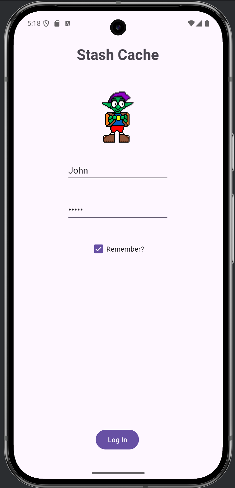
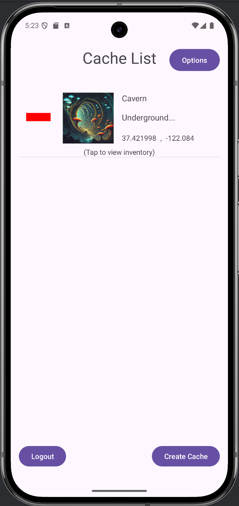
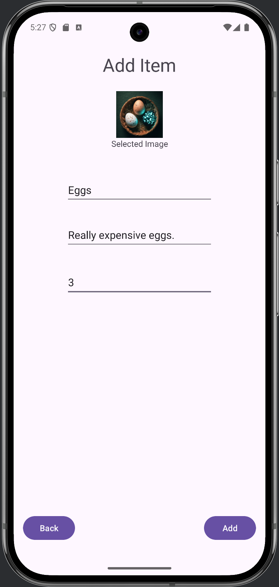
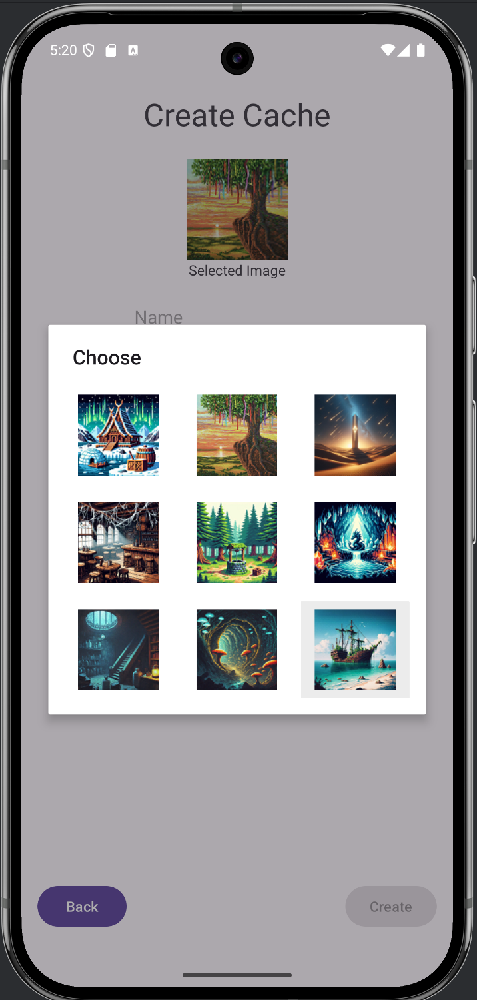
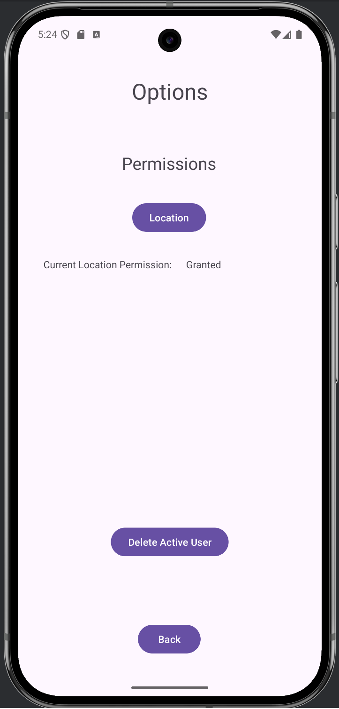
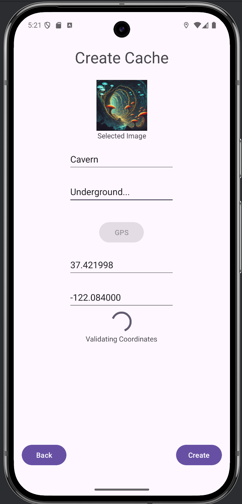
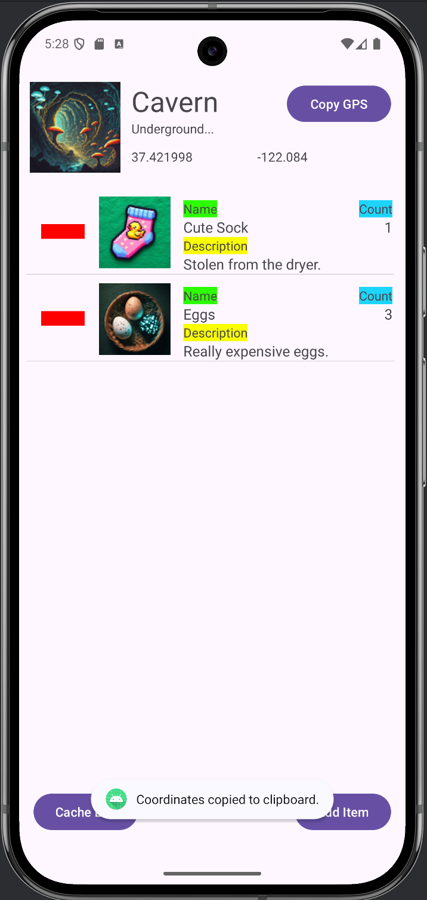
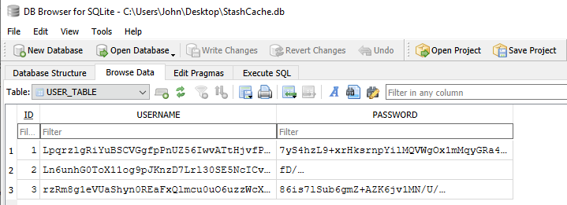
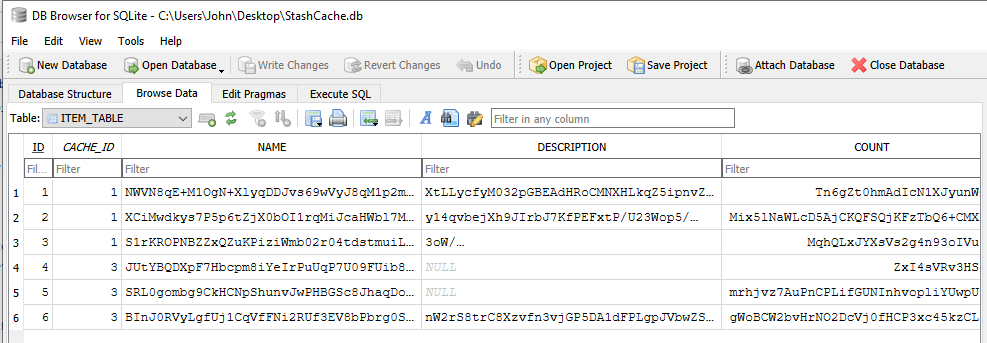
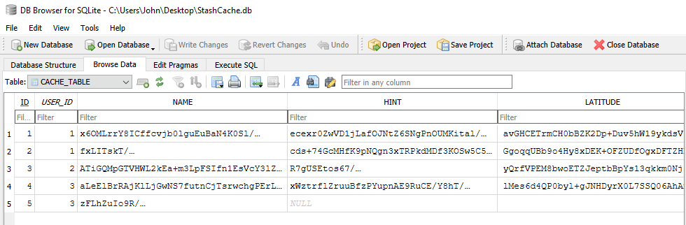

           

**Professional Self-Assessment**  

Hello, my name is John Clark, and this is a professional self-assessment of what I have learned while enrolled in the Southern New Hampshire University (SNHU) computer science program and how I have applied that knowledge through enhancing a project I created. Starting with an interest in coding with my family’s Commodore 64 in the mid-1980’s, I copied countless lines of code from overdue library books to successfully change the color of the screen. Not wickedly impressive, I know, but I was six. Jumping forward a decade, I built a few personal computers (PCs) after attending some sketchy computer conventions with friends. I utilized those PCs mainly for gaming and for creating branching stories with an early application I had purchased. Another decade later,  I found myself working as a project coordinator for a video game publisher in their quality assurance department, spending most of my work downtime developing visual basic (VBA) macros in Microsoft’s Excel to increase my department’s efficiency. One macro I wrote to extract the localization macros from a game’s text files was especially helpful for an online MMORPG filled with inconsistencies. We also used the macro to extract cleverly disguised obscenities for reporting to the ESRB during our ratings submissions.  
           
Over a decade of working in quality assurance for that company, I noticed that many of the same errors would occur at the beginning of every project due to the ever-changing development teams. The most common issues occurred within a project’s database, preventing the department's essential job duties of reporting and tracking bugs. Additionally, many projects started with game builds that lacked stability and would constantly crash. While there were some developers I worked with that maintained their employees, most projects still began with the same faulty database or unstable builds, requiring resources from our limited development time to address. That part of the job was always disheartening, as systems to ensure database stability could have easily been implemented. Figuring that I had enjoyed learning about coding so far, I enrolled at SNHU to earn a computer science degree with a focus on software engineering to become a responsible developer.  
           
There were many early lessons in the SNHU computer science program that equated writing a program to a recipe, with the computer’s central processing unit (CPU) being the chef. This simple analogy I recall whenever I encounter a logic problem while writing code. Additionally, when I took a software reverse engineering course that focused on assembly language, I was able to see what happens inside the processor through simple syntax, like ADD for addition and JMP for conditional if statements followed by the variables they affect. Ultimately, a processor performs simple calculations and moves data between tiny stores of memory called registers, once the assembly language is converted into the binary machine language it understands. Writing code for all the processes a computer or program performs in binary is too difficult for most to do, including myself. However, once you understand that performing a simple addition calculation and rendering a complex 3D model, frame by frame, pixel by pixel to a display depending on its refresh rate can both be reduced to ones and zeros, you realize the only limits to programming and computing are the energy, effort, and imagination supplied to them.  
           
Most of my education at SNHU was solitary, with little chance for collaborating in a team environment, or communicating with stakeholders. However, one school project had me interview some friends as mock stakeholders, and my previous work experience had me leading teams of more than forty people on nine month long projects, reporting to all sorts of interested and involved parties. Working with inspired individuals towards the common good has always been enjoyable, though.  

In order to demonstrate my knowledge of software design, software engineering, algorithms, data structures, and databases, I chose to update a project I started in my mobile architecture and programming course as it encompassed all aspects. I was plagued by the project being incomplete when I initially submitted it, so I made it a personal goal to start over and complete it this time. The initial project required a functional SQLite database with a login option and a permission activity to allow the short message service (SMS) feature on an Android device to inform a user of a change to the database. The parameters of the project were well-defined, but after meeting the base requirements, I tried swapping styles for the user interface (UI) and attempted to add encryption. Unfortunately, I ran out of time and learned to always keep back-ups of working builds before I adversely affect them.  
           
My associated code review discusses the initial project as well as the first updated version I started over with. The review shows what areas I needed to address to enhance the design, and algorithms necessary to utilize the SQLite database appropriately. The accompanying narratives per update after the code review indicate how I have done that as well as enhancing the data structures and security throughout my project. One lesson that was iterated over and over on security is that a zero trust policy should always be followed. Never trusting any input until it is verified as acceptable will protect your program’s processes and the memory of the device it is run on from both malicious actors and careless users who may accidentally destroy everything with ASCII art.  
           
With the completed enhanced project, my software engineering and design choices took a broken two-tier database with limited UI and transformed it into a working three-tier database with encryption, GPS location services, and a simple image selection grid.  Being the only stakeholder for the project, I had free rein to decide where my efforts went. As the narratives point out, I started with solidifying the main functionality of the full stack front-end UI to the back end database before adding in the additional features, keeping back-ups of the working builds this time around.  
           
Finally, I would like to release this project for free on the Android store after localizing it into a few languages, adding some additional UI artwork, and further testing it on physical devices out in the world. Until then, I have included a signed Android Package (APK) that can be installed on a physical or virtual device for anyone to download. While there may be many applications around the world that perform similar or the exact same functions, I know mine is simple and secure.  

**Original CS360 Project: Zip Contents**  
Non-functional Android Studio project, with many comments only stating **"FIXME"** or **"Please add the correct logic."**

**Update_01: Zip Contents**   
A simple, yet functional two-tier SQLite database application with login and cache creation. Addition of comments on algorithms, debug logs for tracking, and better format consistency from the original.

           

**Code Review: Link**  
https://youtu.be/Qr_exohsXqc  
The TODO's in this README were constructed after performing a code review on the the non-functioning **Original**, 
and the functional **Update_01**. The review starts with coverage on the **Original** before moving onto the updated build.  

TODO:
- Implementation of the inventory, the third tier of the database, connecting items to each cache.
- Adding images for each cache and each item while updating each layout's user interface (UI).
  
                
**Update_02: Zip Contents**  
A functional three-tier SQLite database with login, cache creation, and adding items to a cache's inventory.
Implementation of a grid image selection for choosing cache and item images.
Continued addition of comments on algorithms, debug logs for tracking, and better format consistency.  

**Narrative for Update_02:**  
Following along with my initial plan of ensuring the base functionality of a three-tier database (i.e., users, caches, and items) in my application, I began by creating constant points of reference for myself, in the form of an Agile board (i.e., cork boards with index cards), hand-drawn wireframe sketches of my desired UI, and a basic data flow diagram with the contents of the database, its schema, included. Utilizing those design documents, I implemented the item tier of the SQLite database by ensuring their foreign keys were linked appropriately to their associated cache IDs. I had done similar when linking caches to user IDs in the previous update, so I added additional methods to my DatabaseManager class to handle the new item interactions. Additionally, I created a pop-up layout that would be generated when clicking on an image during cache or item creation. This layout depicts a list of nine images that are programmatically assigned a listener, which allows them to be clicked. Once clicked, the associated integer that signifies the image's position in the list is saved as the desired variable, the pop-up selection grid layout closes, and the chosen image is displayed any time the cache or item is returned from the database.

           
           

TODO:
- Addition of a permissions activity to allow access of GPS sensor.
- Addition of a GPS manager class to obtain GPS coordinates from sensor.

**Update_03: Zip Contents**  
A functional three-tier SQLite database holding usernames and passwords, cache details including latitude
and longitude (while location services permissions are granted), and specific item information per cache.
Reduction of debug logs to clean up source code.  

**Narrative for Update_03:**  
After ensuring my database was fully functional with the variables I had assigned to each cache and each item, I focused on accessing the GPS sensor to obtain a device's current coordinates. Utilizing the Android API to fetch the location services from the sensor saved me a lot of coding, as the tools were already in place. While keeping the GPS sensor active helps keep location accuracy high, it is also a huge drain on the battery. With my design wanting to limit battery use yet keep high accuracy, I wrote an algorithm to first immediately fetch and return any last known location from when the GPS sensor was last active, then search for satellite signal until an acceptable accuracy is reached, which I set at 20 meters. Once the accuracy is reached, the GPS sensor stops communicating with satellites to conserve battery life, the current coordinates are returned by the function, and the UI is updated with the results. However, being able to use the GPS sensor in the first place requires a user to allow that functionality. I implemented a simple boolean to determine if a user had booted for the first time and prompted them with an option to allow location services to use the GPS sensor if they had. Additionally, I created a permissions page to allow toggling the permission on when denied, or opening the app settings to manually deny location services as they cannot be programmatically denied. When location permissions are denied, I removed the ability for the user to click the GPS button, however I still allow them to manually input numbers should they choose.

           
           

TODO:
- Addition of an encryption manager to secure all stored data.
- Addition of user interface elements such as borders and art to organize space.
- Clean up source code.

**Update_04: Zip Contents**  
A functional three-tier SQLite database using AES-256 encryption for stored usernames, passwords, cache
details, and item details. While location services permissions are granted, allows acquisition of GPS
coordinates. Previous debug logs removed with most runtime errors currently being ignored in the try/catch
blocks if they occur. 

**Narrative for Update_04:**
I removed the ability to click the GPS button while it is searching for satellite and temporarily display a loading animation and message.

           

           
           
           

**StashCache_Beta.apk:**  
The signed Android Package (APK) file generated using **Update_04** for testing and feedback.

POSSIBLE FUTURE UPDATES: 
- Addition of user interface elements such as borders and art to organize space.
- Addition of user interface functionality such as editing the count for items and the GPS location for caches. 
- Localization into Japanese, FIGS (French, Italian, German, and Spanish), and other common languages.

           

